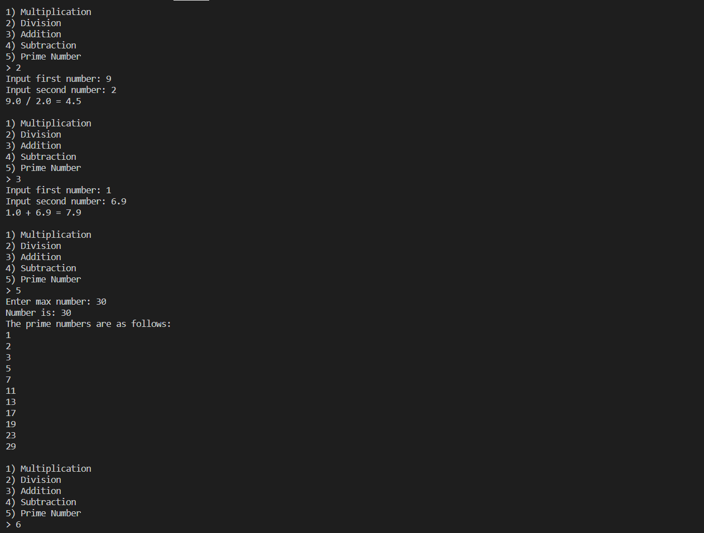

# Description  
This program is a calculator that solves basic math problems, with an added functionality that grabs all prime numbers from a range of zero to the specified number.

# Setup and Execution
This program was created on Visual Studio Code in the Python Language. Ensure that the Python extension is added by checking the extension tab at the middle of the screen. Once set up, the program is easy to replicate as it runs a while loop to keep the program running. Inside the while loop, it takes conditions to run the specific operation; which includes running the operation and then displaying the result.

# Example

# Useful Websites
[w3schools](https://www.w3schools.com/python/default.asp) - contains tutorials for Python.